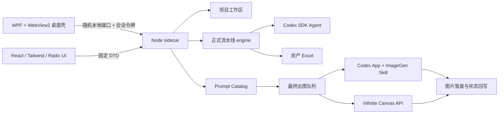
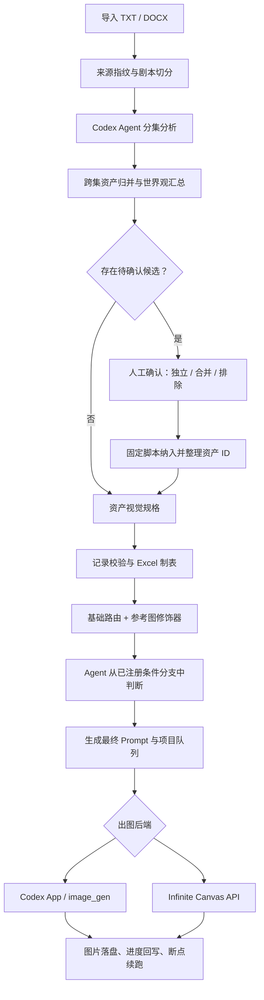

# KA Asset Batch

KA Asset Batch 是面向剧本资产生产的 Windows 桌面软件。它把项目管理、剧本拆分、资产分析、世界观汇总、Excel 制表、提示词路由、参考图、批量队列和出图交接放在同一个窗口中；Prompt Studio 是其中的开发者工作台，不是另一套独立软件。

当前版本：`1.0.0`。支持 Windows 10/11 x64。

## 1. 用户快速开始

### 1.1 前置条件

- 安装并登录 Codex App。剧本分析 Agent、内置 ImageGen 任务和 Excel 制表所需运行环境均由 Codex App 账户与运行时提供。
- 安装程序会在缺失时安装 Microsoft Edge WebView2 Runtime。
- 使用 Infinite Canvas API 时，需要该服务的有效账号；账号密码和登录令牌只保留在本次软件进程内，不写入项目文件。

### 1.2 安装

运行 `KA-Asset-Batch-Setup-1.0.0.exe`。安装程序默认优先选择 `D:\KA Asset Batch`；没有 D 盘时使用当前用户的 LocalAppData，也可以在安装向导中改到其他有足够空间的目录。

安装包包含：

- .NET 10 自包含 WPF 桌面壳；
- React 生产页面；
- 固定 Node.js 运行时；
- 锁定版本的 Codex SDK sidecar 依赖；
- 正式流水线、Prompt Catalog 和软件级 Skills；
- WebView2 官方引导程序。

用户首次启动时不会执行 `npm install`，也不需要安装 Node.js、.NET SDK 或源码工具链。

### 1.3 正常工作流程

1. 新建项目，或把 `.txt` / `.docx` 剧本拖入监听页；拖入剧本会建立项目并保存原始剧本。
2. 启动任务后，监听页依次显示剧本切分、剧本分析累计、世界观总览、资产设定、Excel 制表和资产生成状态。
3. 名称或别名身份冲突不会中断分集分析；候选会带完整事实草稿和首次需求顺序进入人工确认窗口。全剧与世界观完成后，任务在制表前安全等待；全部确认后固定脚本统一纳入、整理资产 ID，并自动续跑资产设定与 Excel。
4. 每个项目拥有独立剧本、Cache、输出、队列和锁；切换当前项目不会停止其他正在运行的项目。
5. 打开“批量出图 / Prompt Studio”，选择制作风格、资产类别、出图限制、后端和各类别参考图。
6. Prompt Studio 根据基础路由、参考图修饰器和 Agent 命中的条件分支生成最终 Prompt 与队列。
7. 使用 Codex 内置 ImageGen 时，软件生成安全交接单、复制到剪贴板并拉起 Codex App；在新任务中粘贴一次后，软件内置 ImageGen Skill 会按项目领取队列、生成图片、落盘并回写状态。
8. 使用 Infinite Canvas API 时，登录后从真实项目和模型列表选择目标，直接执行普通资产批量出图或目录批量重绘。
9. Excel 和图片位于当前项目的 `输出` 目录，可从监听页直接打开项目目录或输出目录。

### 1.4 更新与卸载

- 更新：直接运行版本号更高的安装包。固定 `AppId` 会识别旧版本并覆盖程序文件，不覆盖 `workspace`。
- 卸载：从 Windows“已安装的应用”卸载。卸载结束时会询问是否同时删除全部项目、Cache、输出、队列和路由预设；默认选择“否”即可保留数据。
- 当前没有联网自动更新服务。发布新版本仍需分发新的安装程序。

> 安装包当前未使用商业 Authenticode 代码签名证书。首次在其他电脑运行时可能出现 Windows SmartScreen 提示；发布者应同时提供 `SHA256SUMS.txt` 供接收者核对文件完整性。

## 2. 产品功能

### 2.1 主监听窗口

- 项目卡片：新建、选择、重命名和删除当前项目。
- 项目目录：打开当前项目根或输出目录。
- 任务状态：大标题显示当前阶段，小标题显示当前剧本来源；总进度条位于阶段标题与阶段卡片之间。
- 阶段卡片：运行中显示旋转状态与高亮边框，完成后显示绿色边框和完成勾。
- 资产拆分概览：角色、生物、群演、场景、道具数量。
- 剧本入口：拖入或选择 TXT/DOCX，创建项目并启动正式流水线。
- 任务隔离：同一窗口可观察多个独立项目；每个项目的后台进程、Cache、队列和锁互不覆盖。

### 2.2 批量出图

- 制作风格：二次元、CG、真人。
- 资产类别：角色、生物、群演、场景、道具，可组合勾选。
- 出图限制：Codex 内置 ImageGen 和 Infinite Canvas API 均会在建立队列时应用限制。
- 参考图：每个资产类别保存独立图片集合；支持点击或拖入、多文件上传、删除和大图预览。
- 参考图方式：无参考图、视觉一致性、风格参考和自定义；自定义方式可填写自己的参考图字段。
- 队列状态：展示待处理、进行中、已完成和失败数量。

### 2.3 Infinite Canvas API

- 切换后端后，批量页直接切换为 API 配置，不再弹出额外配置窗口。
- 输入账号密码后读取真实项目和具有 `image_generation` 能力的模型。
- 支持并发数量、画面比例和 1K/2K 尺寸；不提供 512 和 4K。
- 普通资产批量出图会发送由 Prompt Studio 解析后的最终 Prompt。
- 目录批量重绘支持源目录、输出目录和统一重绘说明。
- 服务地址、密码与 JWT 不写入磁盘；任务子进程只接收允许的环境变量。

### 2.4 Prompt Studio

Prompt Studio 作为覆盖在监听窗口上的同窗口工作台。桌面壳会在屏幕工作区允许时向外扩展窗口，React 前景页叠放在原监听页之上；点击露出的监听页边缘、关闭按钮或按 `Esc` 可返回。打开和关闭会恢复原窗口位置、尺寸与最大化状态。

四个工作区：

- 本次批量：配置风格、类别、限制、后端、参考图并建立真实队列。
- 基础提示词：按风格、资产类型和参考图方式查看或编辑通用基础字段；路由轨迹默认折叠。
- 路由/分支：维护条件分支、判断说明、冲突策略和命中后的字段操作。
- 单项检查：粘贴一个资产的完整制作说明，查看解析字段、命中分支和最终 Prompt，并可发起单项出图测试。

路由/分支使用方式：

1. 先选择资产类型、适用风格和参考图方式。
2. 填写通俗的分支名称与“什么情况下使用”说明。
3. 设置命中后要追加、覆盖或替换的目标字段和内容。
4. 在单项测试区提交完整制作说明。Agent 只能从已注册、作用域匹配的分支中判断，不会凭空创建路由。
5. 确认后写入正式 Prompt Catalog；保存和删除都校验 Catalog 指纹，避免多人操作时静默覆盖。

预设与协作：

- 预设卡片可直接点击切换，并支持新建、重命名、删除、导入和导出当前预设。
- 分支支持多选导出，也支持一次导入多个分支文件。
- 同名预设、相同稳定 ID 或疑似同一分支的不同版本会先显示新增、相同和冲突；只有确认后才覆盖。
- 本机预设卡片与正式 Catalog 分支是两个层级；删除预设卡片不会偷偷删除共享正式分支。

## 3. 运行时架构



### 3.1 进程边界

- WPF 只管理原生窗口、WebView2、sidecar 生命周期、安全令牌、保存对话框、系统目录动作和 Codex App 拉起。
- React 不直接访问文件系统、不执行 PowerShell，也不知道项目绝对路径。
- Node sidecar 只监听 `127.0.0.1` 的随机端口。WebView 与 native 使用不同随机令牌；敏感桌面端点只接受 native 令牌。
- WPF 退出时先请求受保护的 `/shutdown`，再通过 Windows Job Object 回收整个 sidecar 进程树。
- 外部导航、新窗口、下载、网页权限、密码自动保存和生产环境 DevTools 均关闭。

### 3.2 项目隔离

开发网页模式默认写入 `.local/workspace`；桌面源码运行和安装版写入软件根的 `workspace`：

```text
workspace/
├─ shared-assets/                    # 当前正式 Prompt Catalog 与公共资产快照
├─ .shared-assets-source.json        # 公共资产来源指纹
└─ projects/
   └─ <projectId>/
      ├─ project.json
      ├─ 剧本/
      ├─ cache/                       # 状态、指纹、分支匹配、队列、进度、锁
      ├─ 输出/                        # 世界观、资产 Excel、生成图片
      ├─ scripts/                     # 受控流水线脚本快照
      └─ assets/                      # 当前项目使用的 Prompt/模板快照
```

项目 ID 由规范化名称和 SHA-256 短指纹生成；名称、文件名、大小、路径边界、符号链接和目录联接都会校验。更新公共资源时先写临时目录并原子替换，项目数据写入也使用临时文件/目录和重命名，避免中断留下半写状态。

### 3.3 剧本到图片的正式流程



关键原则：

- Agent 负责阅读制作说明并在候选分支中判断；程序负责作用域筛选、schema 校验、指纹、冲突、字段应用和队列一致性。
- 条件分支只修改声明的目标字段。普通场景与角色、生物、群演、道具使用同一套字段机制，不再存在 CG 场景专属的 11 项 `sceneDetail` 特例。
- 队列项只有领取后才加锁；成功、失败、暂停和重跑都有显式状态，不把失败伪装成成功。
- 参考图先校验格式、像素和大小，再按内容指纹保存；同一张图不会因文件名不同被重复存储。

## 4. 源码目录

```text
prompt-studio-prototype/
├─ desktop/                     # .NET 10 WPF + WebView2 薄壳
│  └─ PromptStudio.Desktop/
├─ engine/                      # 正式流水线，运行时不依赖外部安装包
│  ├─ assets/                   # Excel 模板、Prompt Catalog、基础路由与修饰器
│  ├─ references/               # 数据、提示词、资产和 API 契约
│  └─ scripts/
│     ├─ commands/              # 固定命令入口
│     ├─ lib/                   # 原子 IO、锁、协议、安全与运行时
│     └─ pipeline/              # 切分、汇总、制表、队列和进度动作
├─ skills/                      # 软件运行时内置的两套公共 Skill
│  ├─ ka-script-pipeline/       # 剧本分析与最终队列，不调用 image_gen
│  └─ ka-builtin-imagegen/      # Codex App 调度与逐项 ImageGen 执行
├─ src/
│  ├─ server/                   # 本地 API、项目隔离、编排、Catalog、后端服务
│  └─ ui/
│     ├─ components/ui/         # shadcn 风格的 Radix UI 原语
│     ├─ features/              # 可继续拆分的业务视图
│     ├─ services/              # 前端 DTO 与调用适配器
│     ├─ App.tsx                # 稳定应用入口
│     └─ styles/
├─ packaging/                   # 干净发行目录与 Inno Setup 安装包脚本
│  ├─ sidecar/                  # 最小生产依赖清单
│  ├─ build-release.ps1
│  ├─ build-installer.ps1
│  └─ installer.iss
├─ tests/                       # Node、服务、UI 契约、桌面、安全、性能、打包测试
├─ tools/dev.mjs               # 4173 前端 + 4174 后端开发入口
├─ docs/                        # 结构与桌面桥补充说明
├─ package.json
└─ vite.config.ts
```

`node_modules`、`dist`、`artifacts`、`.local`、`workspace`、`.verify`、桌面 `bin/obj` 都是可重建或运行时目录，不属于源码。

## 5. 主要实现模块

### 5.1 前端

- `src/ui/App.tsx`：监听页、Prompt Studio 舞台、四个工作区和全局状态组合。
- `src/ui/features/prompt-studio/prompt-field-list.tsx`：以冒号为基准对齐的基础/最终 Prompt 字段列表。
- `src/ui/services/project-control-adapter.mjs`：项目、剧本和任务 DTO。
- `src/ui/services/batch-control-adapter.mjs`：参考图、批次、API 后端和队列 DTO。
- `src/ui/services/catalog-adapter.mjs`：基础路由、字段解析和 Catalog 调用。
- `src/ui/services/route-module-workbench.mjs`：分支草稿、预设导入导出与冲突模型。
- `src/ui/services/imagegen-handoff-adapter.mjs`：内置 ImageGen 交接状态。

页面使用 React 19、Vite 8、Tailwind CSS 4、Radix UI、Lucide。生产构建把 React、Radix 和图标拆为稳定 vendor chunks，减少主业务包解析压力；长路由列表分页，每页上限 100，10,000 条筛选/分页有性能门禁。

### 5.2 Node sidecar

- `software-workspace.mjs`：项目创建、重命名、删除、剧本、运行时快照和安全路径。
- `project-root-index.mjs`：允许访问的真实项目根索引。
- `pipeline-task-runner.mjs`：任务状态机与固定流水线动作。
- `codex-agent-worker.mjs`：Codex SDK Agent 调度。
- `prompt-registry-service.mjs`：Catalog schema、版本、指纹、基础路由和条件修饰器。
- `prompt-branch-classification.mjs`：候选分支请求、Agent 回执校验和匹配原子写入。
- `reference-image-store.mjs`：参考图校验、归类、内容指纹和快照。
- `builtin-batch-service.mjs`：批次保存、队列构建与后端参数。
- `codex-imagegen-handoff.mjs`：Codex App 交接单。
- `intinify-canvas-service.mjs`：Infinite Canvas 登录、项目/模型查询和临时会话。
- `desktop-entry.mjs`：桌面固定动作和 native 能力。
- `server.mjs`：loopback HTTP 路由、令牌校验、DTO 边界和静态页面服务。

### 5.3 桌面壳

- `DesktopPaths.cs`：解析 sidecar、engine、Node 和软件数据根。
- `DesktopSidecar.cs`：启动随机端口 sidecar、校验 ready/health、退出回收。
- `DesktopRpcBridge.cs`：白名单 JSON-RPC；不接受任意命令和任意路径。
- `MainWindow.cs`：WebView2 安全配置、窗口舞台、导出保存框、剪贴板和 Codex 拉起。
- `WindowsJobObject.cs`：保证桌面退出时子进程树不残留。

## 6. HTTP 与原生桥

主要 HTTP 能力：

- 项目：`GET/POST /api/projects`，项目重命名/删除、剧本上传、目录快照。
- 任务：创建流水线任务、查询状态和进度。
- Prompt：状态、基础字段、resolve、conditionModule 校验/保存/删除。
- 批次：参考图、内置批次、队列和 ImageGen 交接状态。
- Infinite Canvas：登录、项目/模型列表、配置校验和批量任务。

桌面 JSON-RPC 白名单：

- `selectProject({ projectId, expectedRevision })`
- `openProjectDirectory({ projectId, kind })`
- `prepareBuiltinImagegen({ projectId })`
- `setStudioDrawerOpen({ open, width? })`
- 受控 JSON 导出保存

所有接口只返回 UI 必需字段。项目绝对路径、完整交接 Prompt、native token 和凭据不会通过普通网页响应暴露。

## 7. 开发与调试

### 7.1 工具链

- Node.js 与 npm
- .NET 10 SDK
- Windows x64
- Inno Setup 6（只在制作安装包时需要）
- Codex App（真实 Agent / ImageGen / Excel 流程验收）

安装依赖：

```powershell
cd <源码目录>
npm install
dotnet restore .\desktop\PromptStudio.Desktop\PromptStudio.Desktop.csproj
```

网页开发：

```powershell
npm run dev
```

打开 `http://127.0.0.1:4173/`。Vite 把 `/api`、`/desktop`、`/health` 和 `/shutdown` 代理到 4174；不要用 `file://` 打开页面。

桌面调试：

```powershell
dotnet run --project .\desktop\PromptStudio.Desktop\PromptStudio.Desktop.csproj
```

只有定位桌面 WebView 问题时才临时设置 `KA_PROMPT_STUDIO_DEVTOOLS=1`。其余诊断覆盖变量见 `desktop/README.md`。

### 7.2 完整验证

```powershell
npm run check
```

该命令依次执行：

1. Node 服务脚本语法检查；
2. TypeScript 检查；
3. Vite 生产构建；
4. 全部 Node 测试；
5. .NET 桌面构建。

测试覆盖项目隔离、原子写入、Prompt Catalog、路由判断、参考图、队列、Codex 交接、Infinite Canvas 契约、桌面令牌、安全导航、窗口往返、布局结构、10k 列表性能和安装包契约。Windows 未开放开发者符号链接权限时，两个符号链接攻击测试会明确跳过；其他失败不能忽略。

### 7.3 构建发行目录

```powershell
npm run build:release
```

输出：`artifacts/release/KA-Asset-Batch/`。脚本会自包含发布 WPF、重装最小 sidecar 生产依赖、复制固定 Node、移除 PDB/XML 文档，并生成逐文件 SHA-256 的 `release-manifest.json`。发行目录禁止包含 `workspace`、`.local` 和测试目录。

### 7.4 构建安装包

```powershell
npm run build:installer
```

输出：

- `artifacts/installer/KA-Asset-Batch-Setup-1.0.0.exe`
- `artifacts/installer/SHA256SUMS.txt`

脚本先运行完整检查，再构建发行目录，下载并验证微软签名的 WebView2 官方引导程序，最后调用 Inno Setup。不要从 `bin/Release` 或源码目录手工打包，那些位置可能包含开发依赖和测试数据。

## 8. 二次开发指南

### 8.1 增加界面功能

1. 新业务视图放入 `src/ui/features/<feature>/`；通用原语放 `src/ui/components/ui/`。
2. 保持 UI 只使用 DTO；本地文件和命令必须通过 adapter → sidecar/native bridge。
3. 复用现有主题 token、卡片间距、抽屉舞台和 motion token。不要在功能修改中顺便重排现有布局。
4. 所有按钮、输入框、选择器和弹窗要有键盘焦点与可访问名称；深色模式下仍需检查勾选、边框和禁用态对比度。
5. 长列表必须分页或虚拟化，禁止一次挂载全部路由/资产卡片。

### 8.2 增加本地 API

1. 在 `src/server/` 实现纯服务模块并写单元测试。
2. 在 `src/server/routes/` 的对应 route 模块注册固定路径、方法、body 上限和 DTO 校验，由 `server.mjs` 统一组合。
3. 前端在 `src/ui/services/` 添加 adapter，组件不直接拼 URL。
4. 若涉及目录或系统动作，进入 native RPC 白名单；不要接受网页传入任意绝对路径、程序名或命令行。
5. 加入 `check:server` 与对应集成测试。

### 8.3 增加流水线动作

1. 协议和通用 IO 放 `engine/scripts/lib/`，具体动作放 `engine/scripts/pipeline/`，固定入口放 `engine/scripts/commands/`。
2. 由 `pipeline-task-runner.mjs` 注册明确动作；不允许前端传入任意脚本。
3. 每项动作必须支持项目根边界、锁、幂等/恢复、原子写入和清晰失败状态。
4. 更新软件级 `skills/ka-script-pipeline/SKILL.md`，不要把 Skill 复制进每个项目。

### 8.4 增加提示词路由/分支

1. 基础路由放 `engine/assets/图片生成/prompts/routes/`。
2. 通用字段片段放 `fragments/`，参考图规则放 `modifiers/reference-mode.json`，条件分支放正式 conditionModules。
3. 为分支设置稳定 ID、通俗名称、作用域、自然语言判断说明、选择策略和字段操作。
4. 先走 validate，再携带当前 Catalog 指纹保存。不要绕过 schema 版本、迁移、冲突和指纹检查。
5. 用“单项检查”验证候选范围、Agent 命中和最终字段，再导出分支或预设给其他成员。
6. 不为某种风格/资产私造独立字段体系；确有新字段需求时先更新统一字段契约和所有资产类型测试。

### 8.5 版本发布

1. 更新根 `package.json`、`packaging/sidecar/package.json` 和桌面项目版本。
2. 更新两个 lockfile。
3. 更新 README 的当前版本与变更说明。
4. 执行 `npm run check`。
5. 执行 `npm run build:installer`。
6. 在干净 Windows 用户环境执行安装、启动、覆盖安装、卸载和数据保留测试。
7. 发布安装程序和 `SHA256SUMS.txt`；有代码签名证书时，对 EXE 和安装程序签名后再发布。

## 9. 故障排查

- 页面打不开：安装/修复 WebView2 Runtime，检查安全软件是否阻止本机随机端口或内置 `node.exe`。
- Codex 没有启动：先确认 Codex App 已安装并登录；交接文本已复制时可手动新建任务并粘贴。
- Agent/Excel 失败：先在 Codex App 完成一次初始化，确认其运行时可用，再查看项目 `cache` 中的任务错误。
- 输出目录打不开：只能通过桌面版调用；网页开发版没有系统目录权限。
- API 登录后无项目/模型：确认账号有可用项目，模型包含 `image_generation` 能力，并检查服务地址是否可访问。
- 路由保存冲突：重新加载最新 Catalog，再对比并合并草稿；不要直接覆盖共享 JSON。
- 更新后项目不见：确认安装到了原目录，或把旧安装目录保留的 `workspace` 移到新软件根。不要只复制单个 Cache 文件。
- 空项目：未导入剧本时只允许配置和查看；启动正式流水线前必须导入 TXT/DOCX。

## 10. 当前边界

- 仅发布 Windows x64 桌面版。
- 没有在线自动更新服务器，使用新版安装包覆盖升级。
- Codex 内置 ImageGen 仍以 Codex App 任务为执行权来源；Node SDK 不冒充图像生成能力。
- 发行安装包未商业签名，跨机器分发可能触发 SmartScreen。
- `App.tsx` 只保留应用入口；工作台与 Prompt Studio 已按 feature 放在 `src/ui/features/`，现有布局和动效契约保持不变。

补充文档：

- `docs/PROJECT-STRUCTURE.md`：目录所有权与新代码放置规则。
- `docs/DESKTOP-BRIDGE.md`：桌面令牌和 RPC 安全边界。
- `desktop/README.md`：WPF/WebView2 生命周期与发布布局。
- `engine/references/`：流水线、资产、Prompt 和 Infinite Canvas API 的正式契约。
